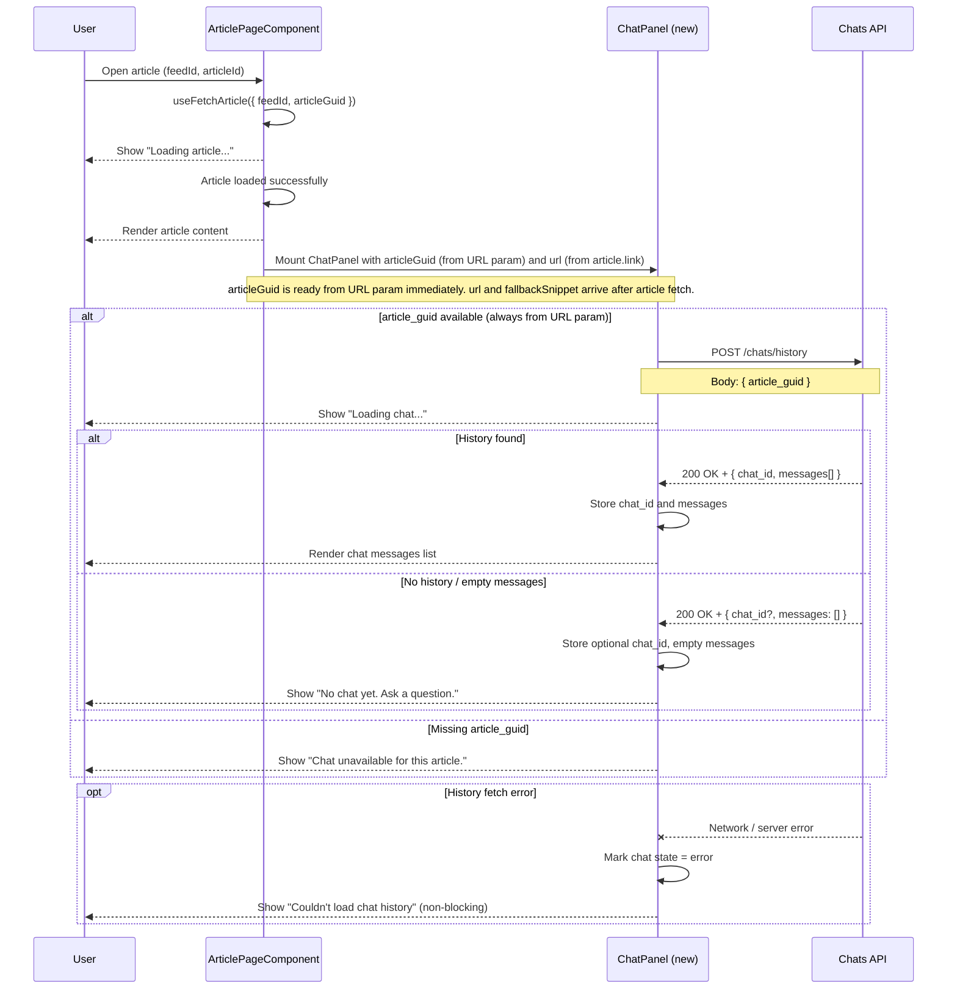
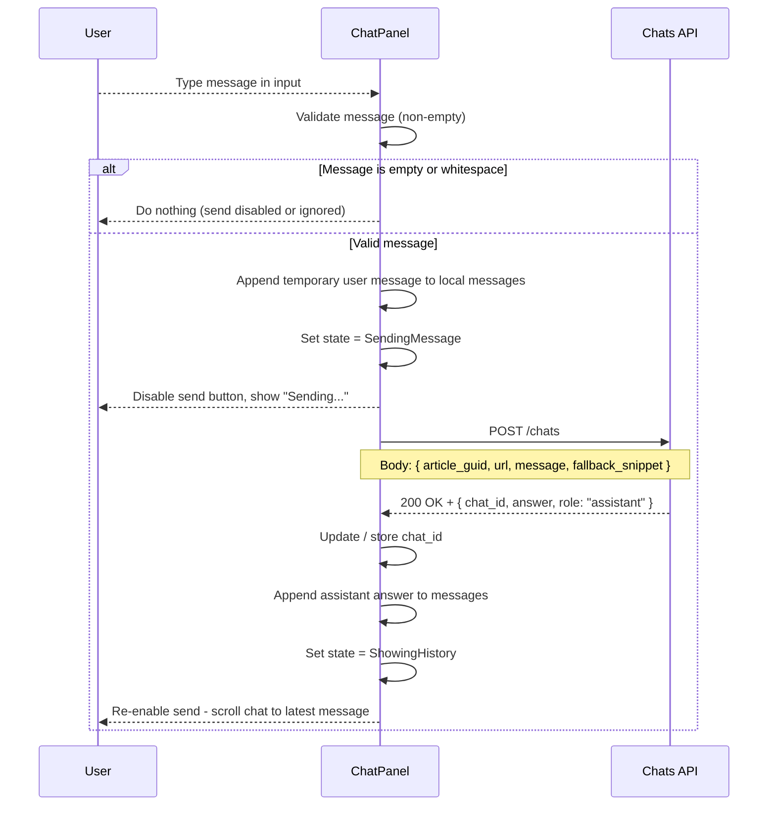
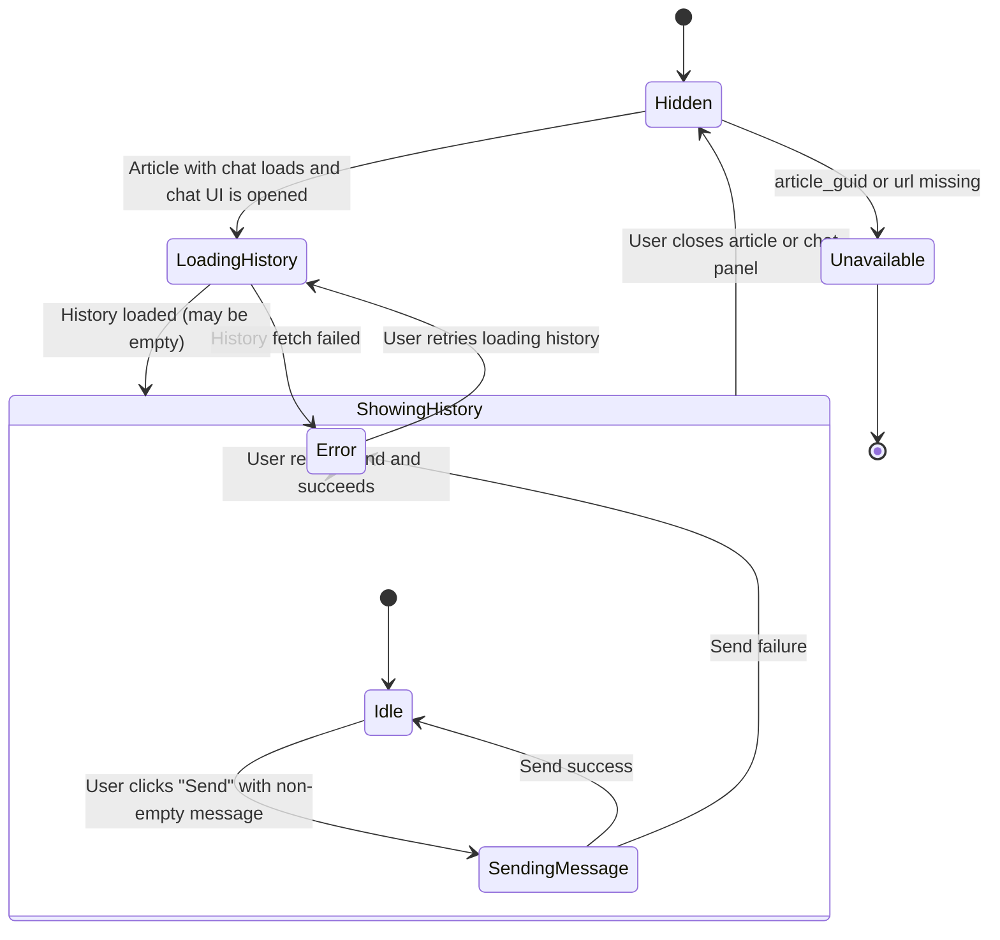
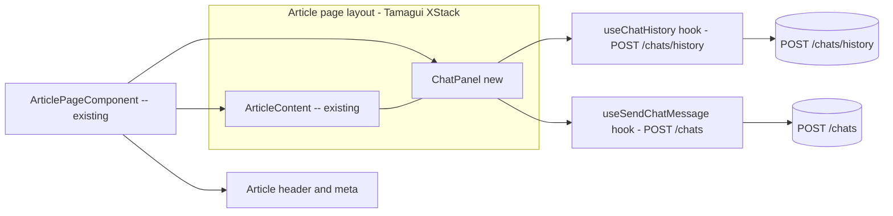

## Chat with article – integration plan

### Short summary

- **History API**: `POST /chats/history` with `article_guid`.
- **Chat API**: `POST /chats` with `article_guid`, `url`, `message`, `fallback_snippet`.
- **Identifiers**:
  - `article_guid` = `decodeURIComponent(articleId)` (URL param).
  - `url` = `article.link`.
  - `fallback_snippet` = `article.summary`.

## Diagram 1 – Page load and chat history fetch

Key integration points in `ArticlePageComponent`:

- Pass `decodeURIComponent(articleId)` as `articleGuid` directly to `ChatPanel` — no need to wait for article fetch.
- Pass `article.link` as `url` and `article.summary` as `fallbackSnippet` once article data is available.
- Ensure layout can accommodate a scrollable chat area without breaking article scrolling.

---

## Diagram 2 – Initiate / continue chat from the article page

## Diagram 3 – Chat panel UI states

## Diagram 4 – High-level component wiring on article page

## Implementation checklist

- [x] **1. Article data wiring**
  - [x] Pass `decodeURIComponent(articleId)` as `articleGuid` to `ChatPanel` — available immediately, no article fetch needed.
  - [x] Pass `article.link` as `url` once article data is loaded.
  - [x] Pass `article.summary` as `fallbackSnippet` once article data is loaded.

- [x] **2. Layout**
  - [x] Update layout to show `ArticleContent` and `ChatPanel` side by side inside the article modal.
  - [x] Use [Tamagui](https://tamagui.dev) `XStack` / `YStack` primitives for the split view and chat panel internals.
  - [x] Ensure `ChatPanel` scroll is independent of the article scroll.

- [x] **3. ChatPanel component**
  - [x] Create `ChatPanel` UI container using Tamagui.
  - [x] Add scrollable messages list area.
  - [x] Add text input and send button.
  - [x] Disable send button when input is empty or whitespace-only.
  - [x] Disable send button until `url` and `fallbackSnippet` are available (article still loading).

- [x] **4. History fetch hook – `useChatHistory`**
  - [x] Implement `useChatHistory(articleGuid)` using `POST /chats/history` with JSON body `{ article_guid }`.
  - [x] Handle loading, success, and error states.
  - [x] Normalize response into `{ chatId, messages[] }` shape for the UI.

- [x] **5. Send message hook – `useSendChatMessage`**
  - [x] Implement `useSendChatMessage()` using `POST /chats`.
  - [x] Accept `{ articleGuid, url, message, fallbackSnippet }` as input.
  - [x] Return mutation state `{ isPending, error, mutateAsync }` for the UI to consume.

- [x] **6. ChatPanel behaviour**
  - [x] On mount, fire `useChatHistory` immediately using `articleGuid`.
  - [x] Show "Loading chat..." while history is fetching.
  - [x] Show empty state when history loads with no messages.
  - [x] Show non-blocking error when history fetch fails but keep input usable.
  - [x] On successful send, append user + assistant messages to local state and scroll to bottom.

- [x] **7. Edge cases**
  - [x] Hide or disable chat when `articleGuid` is missing.
  - [x] Ensure long messages wrap and chat area scrolls independently.
  - [x] Reset chat state when navigating to a different article. (Handled by `articleGuid` in query key.)
  - [x] Prevent multiple rapid sends while a request is in-flight.

- [x] **8. Basic UX polish**
  - [x] Keep user's message in the conversation if a send fails.
  - [x] Use concise inline error messages for history and send failures.
  - [x] Visually distinguish user vs assistant messages.
