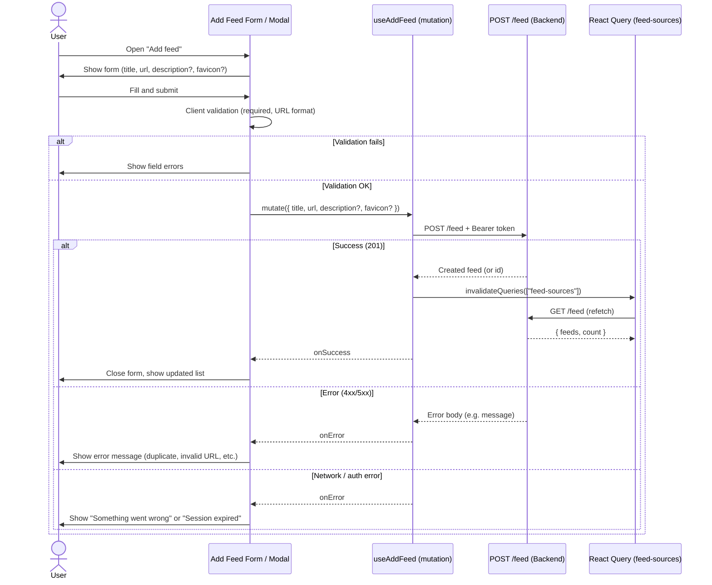
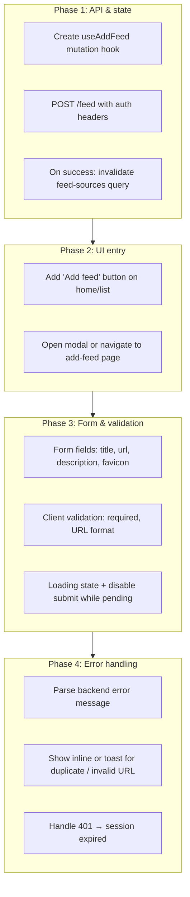

# Add new feed source (POST /feed)

## Sequence diagram – Add feed flow

```mermaid
sequenceDiagram
    actor User
    participant UI as Add Feed Form / Modal
    participant Hook as useAddFeed (mutation)
    participant API as POST /feed (Backend)
    participant Cache as React Query (feed-sources)

    User->>UI: Open "Add feed"
    UI->>User: Show form (title, url, description?, favicon?)

    User->>UI: Fill and submit
    UI->>UI: Client validation (required, URL format)
    alt Validation fails
        UI->>User: Show field errors
    else Validation OK
        UI->>Hook: mutate({ title, url, description?, favicon? })
        Hook->>API: POST /feed + Bearer token
        alt Success (201)
            API-->>Hook: Created feed (or id)
            Hook->>Cache: invalidateQueries(["feed-sources"])
            Cache->>API: GET /feed (refetch)
            API-->>Cache: { feeds, count }
            Hook-->>UI: onSuccess
            UI->>User: Close form, show updated list
        else Error (4xx/5xx)
            API-->>Hook: Error body (e.g. message)
            Hook-->>UI: onError
            UI->>User: Show error message (duplicate, invalid URL, etc.)
        else Network / auth error
            Hook-->>UI: onError
            UI->>User: Show "Something went wrong" or "Session expired"
        end
    end
```

## Planning diagram – Implementation phases

```mermaid
flowchart TB
    subgraph Phase1["Phase 1: API & state"]
        A1[Create useAddFeed mutation hook]
        A2[POST /feed with auth headers]
        A3[On success: invalidate feed-sources query]
    end

    subgraph Phase2["Phase 2: UI entry"]
        B1[Add 'Add feed' button on home/list]
        B2[Open modal or navigate to add-feed page]
    end

    subgraph Phase3["Phase 3: Form & validation"]
        C1[Form fields: title, url, description, favicon]
        C2[Client validation: required, URL format]
        C3[Loading state + disable submit while pending]
    end

    subgraph Phase4["Phase 4: Error handling"]
        D1[Parse backend error message]
        D2[Show inline or toast for duplicate / invalid URL]
        D3[Handle 401 → session expired]
    end

    Phase1 --> Phase2
    Phase2 --> Phase3
    Phase3 --> Phase4
```
