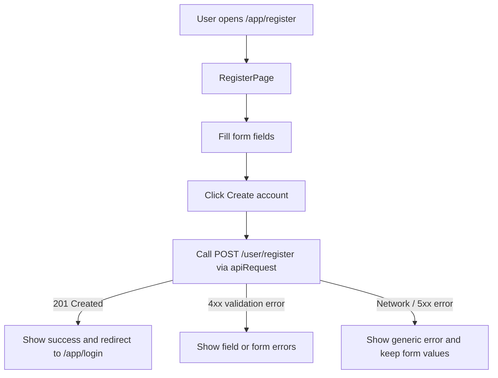
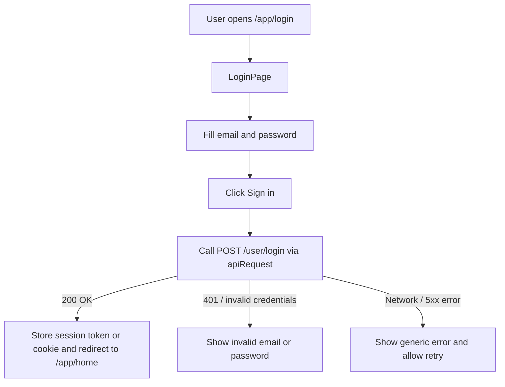
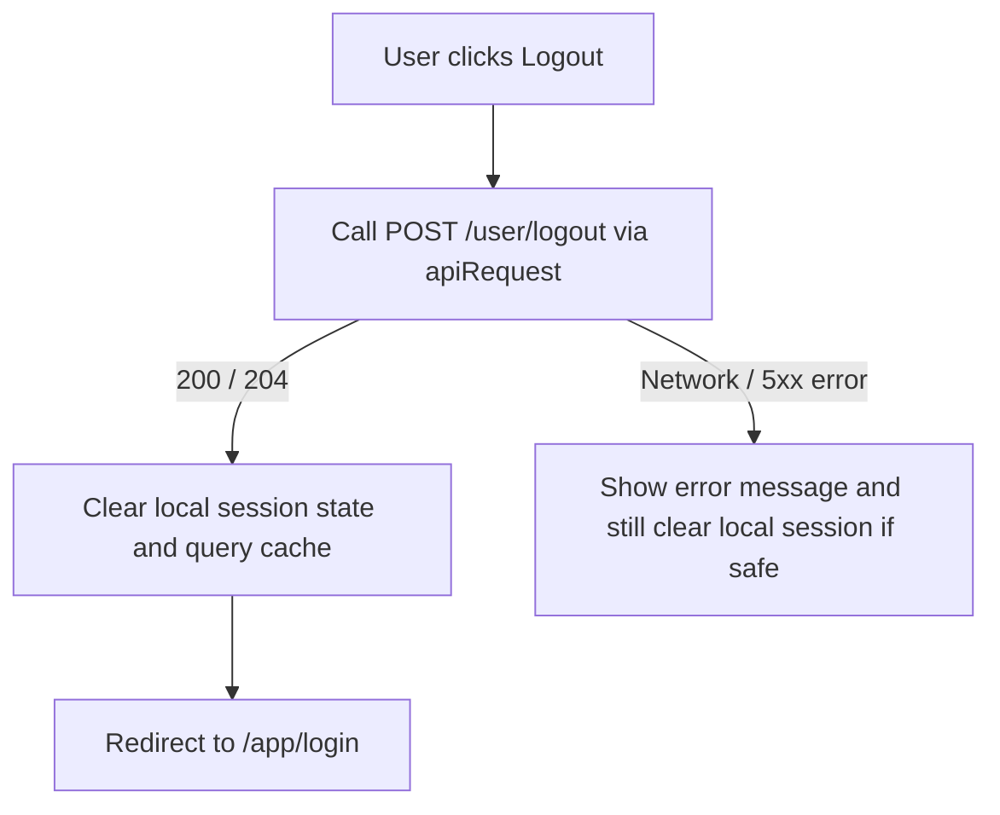
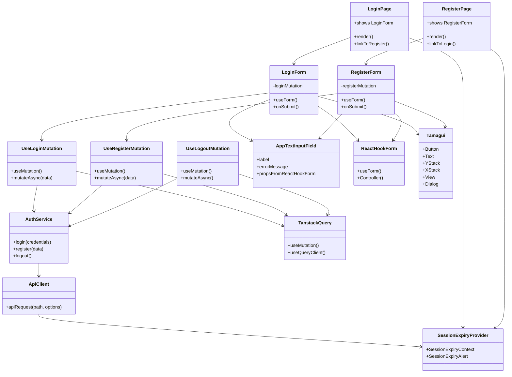
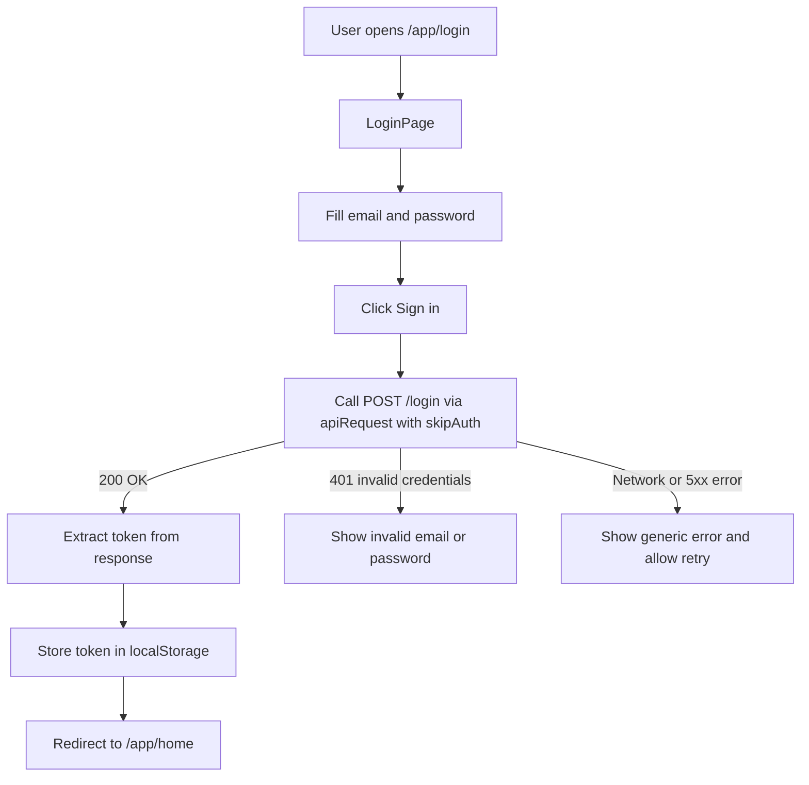
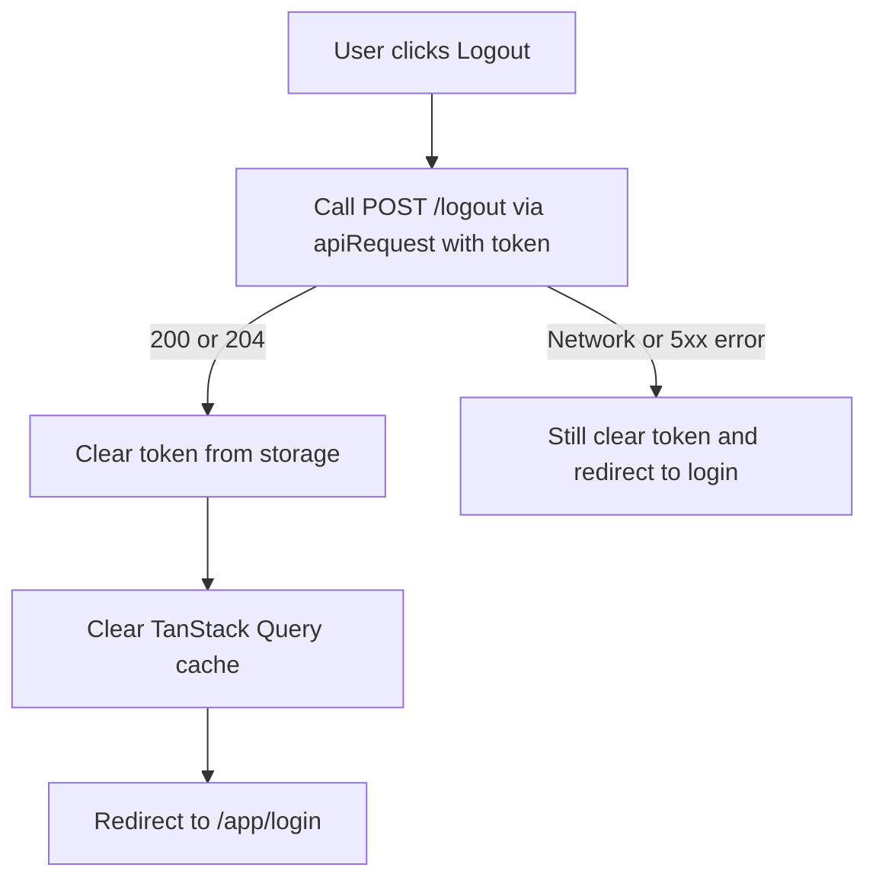
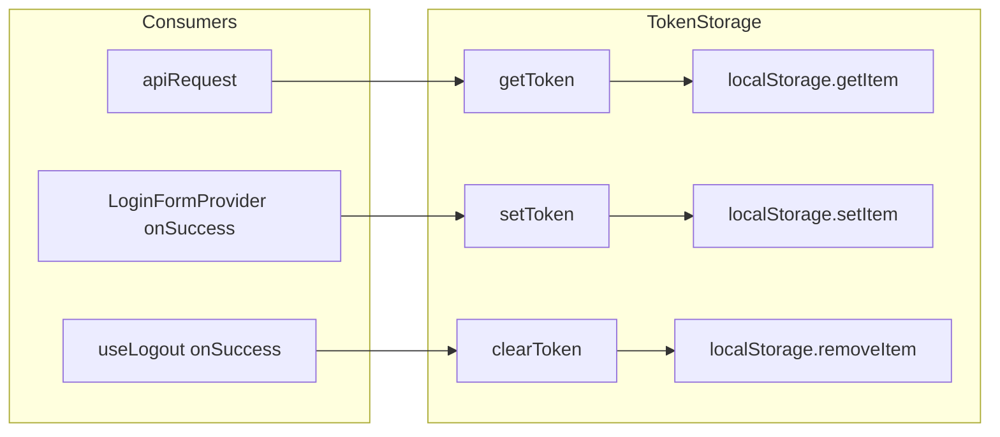
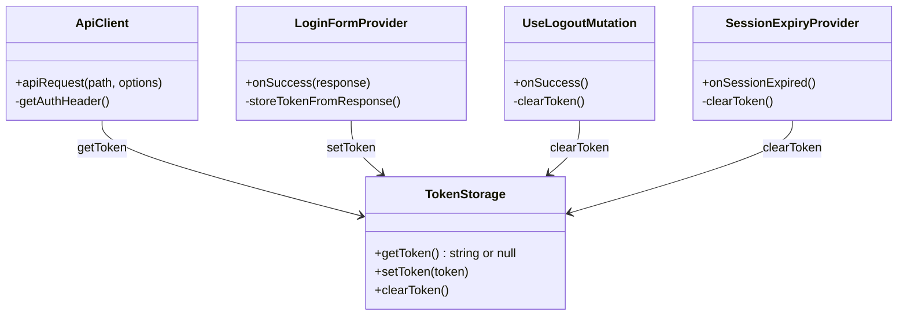

## User authentication – routes and flows

### Routes

- `/app/login` – login screen
- `/app/register` – registration screen

Each screen should include a simple text link to the other:
- On `/app/login`: “Don’t have an account? Register” → `/app/register`
- On `/app/register`: “Already have an account? Login” → `/app/login`

### Register flow (UI + API)

### Login flow (UI + API)

### Logout flow

### Implementation plan

- **1. Create pages**
  - Add `LoginPage` at `/app/login` and `RegisterPage` at `/app/register` using the Next.js `app` router.
  - Use shared layout styles so these screens visually match the rest of the app.

- **2. Build forms**
  - Use existing input components (for example `AppTextInputField`) for email, password, and any extra fields needed for registration.
  - Add validation for required fields and basic email format and password length before calling the API.
  - Disable the submit button and show a spinner while a request is in progress.

- **3. Wire API calls**
  - For register: call the Register API (`@api-tests/user/Register user.bru`) through a small helper that uses `apiRequest("/user/register", { method: "POST", body })`.
  - For login: call the Login API (`@api-tests/user/Login.bru`) via `apiRequest("/user/login", { method: "POST", body })`.
  - For logout: call the Logout API (`@api-tests/user/Logout.bru`) in a central place (for example, a `useLogout` hook).
  - If the auth endpoints must not send an `Authorization` header, add a variant of `apiRequest` or an option to skip the bearer token for these three calls.

- **4. Manage auth state**
  - Decide where to store auth data returned by login (for example, HTTP-only cookie managed by the backend, or an access token stored in memory plus refresh logic).
  - After a successful login, update auth state and redirect to the main app route (for example `/app/home`).
  - After logout, clear auth state, reset relevant React Query caches, and redirect to `/app/login`.

- **5. Navigation links**
  - On the login page, add a link or button to `/app/register`.
  - On the register page, add a link or button to `/app/login`.

- **6. Session expiry integration**
  - Reuse the existing `apiRequest` + `SessionExpiredError` + `SessionExpiryProvider` flow so that if a session expires, the user sees the session-expired modal.
  - When the user dismisses the modal, redirect them to `/app/login` so they can sign in again.

### Edge cases to handle

- **Register**
  - Email already in use → show a clear message and keep the form values.
  - Weak password or other validation rules from the backend → map backend error fields to the right inputs.
  - Password confirmation (if used) does not match → block submit on the client with a simple message.
  - Network / server error → show a generic message, do not clear the form, allow retry.

- **Login**
  - Wrong email or password → show a non-technical message like “Invalid email or password”.
  - Account locked or disabled (if backend supports this) → display the backend message.
  - User already logged in visits `/app/login` or `/app/register` → optionally redirect them to the main app route instead of showing the form.
  - Network / server error → show a generic message and allow retry.

- **Logout**
  - Logout API fails but the token is clearly invalid / expired → clear local state anyway and send the user to `/app/login`.
  - User clicks Logout multiple times quickly → guard with a loading state so only one call is active.

- **General**
  - Keep error messages short and user-friendly (no raw stack traces or technical details).
  - Make sure loading states are visible so the user understands when a request is in progress.
  - Ensure the UI works well on small screens (forms and links should be easy to tap).

### Code structure class diagram

---

## Dynamic token storage (plan)

**Goal:** Replace the static `API_BEARER_TOKEN` from `.env` with a token that is:
1. Returned by the login API
2. Stored in the browser
3. Read and sent on every authenticated API request

### Current vs target

| Aspect | Current | Target |
|--------|---------|--------|
| Token source | `process.env.NEXT_PUBLIC_API_BEARER_TOKEN` | Login API response body |
| Storage | None (env only) | Browser localStorage |
| Usage | Same token for all users | Per-user token from storage |

### Token flow overview

```mermaid
flowchart TD
    subgraph Login
        A[User signs in] --> B[POST /login]
        B --> C{200 OK?}
        C -->|Yes| D[Read token from response body]
        D --> E[Store token in localStorage]
        E --> F[Redirect to /app/home]
        C -->|No| G[Show error]
    end

    subgraph API calls
        H[Any authenticated request] --> I[Read token from storage]
        I --> J{Token exists?}
        J -->|Yes| K[Add Authorization Bearer header]
        K --> L[Send request]
        J -->|No| M[Skip auth or redirect to login]
    end

    subgraph Logout
        N[User clicks Logout] --> O[POST /logout]
        O --> P[Clear token from storage]
        P --> Q[Clear query cache]
        Q --> R[Redirect to /app/login]
    end
```

### Login flow (updated with token storage)

### Logout flow (updated with token clearing)

### Token storage module

### Implementation plan

- **1. Create token storage module** (`src/lib/token-storage.ts`)
  - `getToken(): string | null` – read from `localStorage`
  - `setToken(token: string): void` – write to storage
  - `clearToken(): void` – remove from storage
  - Use a fixed key, e.g. `auth_token` or `rss_feeder_token`

- **2. Update `api-client.ts`**
  - Remove use of `API_BEARER_TOKEN` from constants
  - When `skipAuth` is false: call `getToken()` and use it in the `Authorization` header
  - If no token exists and auth is required: either skip the header (will likely get 401) or throw – the existing `SessionExpiredError` flow will handle 401

- **3. Update login flow**
  - Define `LoginResponse` type (e.g. `{ token: string }` or `{ accessToken: string }` – confirm with backend)
  - In `useLogin` or `LoginFormProvider` `onSuccess`: read the token from the response and call `setToken(token)`
  - Then redirect to `/app/home`

- **4. Update logout flow**
  - In `useLogout` `onSuccess` (or `onSettled`): call `clearToken()` before or after clearing the query cache
  - Redirect to `/app/login` as already done

- **5. Session expiry**
  - When `SessionExpiredError` is thrown (e.g. 401), call `clearToken()` so the next request does not reuse an invalid token
  - The `SessionExpiryProvider` modal already redirects to login on dismiss

- **6. Optional: fallback for dev**
  - If `getToken()` returns null and `NEXT_PUBLIC_API_BEARER_TOKEN` is set, optionally use it as fallback for local development (can be removed later)

### API response shape (to confirm)

The login API response must include the token. Common shapes:

- `{ token: string }`
- `{ accessToken: string }`
- `{ data: { token: string } }`

Confirm the actual response structure with the backend and adjust `LoginResponse` and the extraction logic accordingly.

### Code structure (updated class diagram)

### Edge cases

- **No token on first load** – User visits app without logging in; `getToken()` returns null. Authenticated requests will get 401; `SessionExpiryProvider` will show the modal and redirect to login.
- **Token in storage but expired** – API returns 401; `SessionExpiredError` is thrown; `clearToken()` is called; user is redirected to login.
- **localStorage not available** – In some environments (e.g. private browsing), `localStorage` may throw. Wrap storage calls in try/catch and treat as “no token”.
- **Logout while offline** – Call `clearToken()` and redirect anyway so the user is logged out locally; the server will invalidate the session when it receives the next request.

